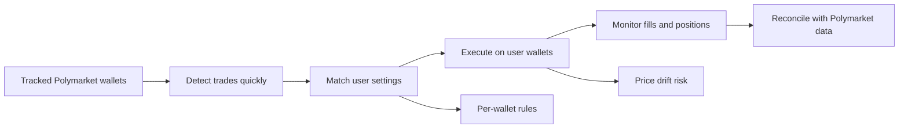
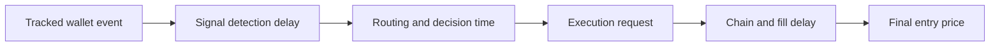
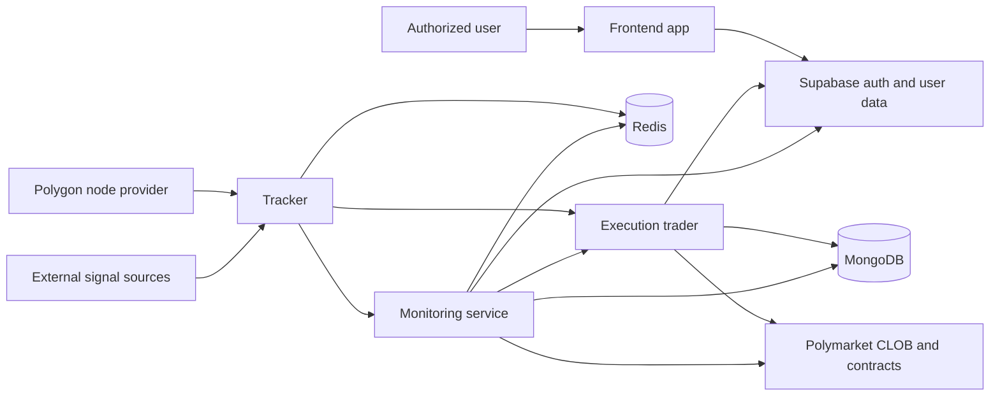
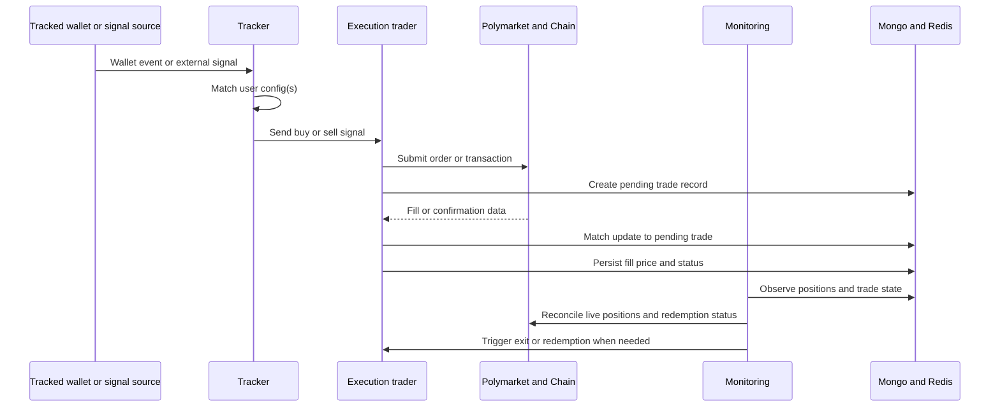
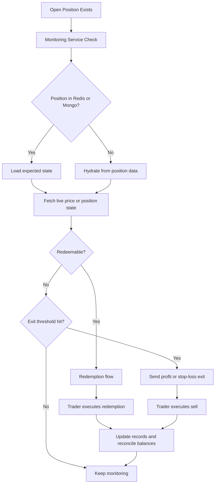

I built this project to answer a practical systems question: how fast and how reliably can you turn external market activity into controlled trading actions across multiple wallets?

It started as a Polymarket wallet-tracker idea and ended up becoming something much more interesting: a trading system shaped by execution latency, wallet-to-signal routing, reconciliation, monitoring, and strategy evolution.

## At a glance

- reduced the path from tracked-wallet event to our own execution request to roughly 1.5 seconds in the initial version, before the planned infrastructure and deployment optimizations
- split the platform into tracker, execution, monitoring, and frontend services so strategy logic could evolve without rewrites
- carried wallet identity and execution policy through the full flow so signals could not be applied to the wrong account
- added reconciliation, price monitoring, and redemption workflows so the system could recover when outside systems were delayed, stale, or incomplete

## What are prediction markets?

Prediction markets are one of the more interesting things to come out of crypto in recent years. At a very simple level, they let you buy and sell positions tied to the outcome of future events.

For example, if you believe Bitcoin will close lower by some date, you can go to a site like Polymarket and buy shares in the "Yes" outcome of a market that represents that belief. If the market resolves in your favor, the winning share redeems at its maximum value. If it does not, that share becomes worthless.

That sounds simple at the product level, but under the hood there is a lot going on.

At least in Polymarket's case, each outcome is represented by its own asset, pricing comes from a central limit order book (CLOB), and final settlement/redemption still has an on-chain component. So if you want to automate anything around it, you are not just dealing with "buy" and "sell." You are dealing with market mappings, asset IDs, order book prices, fills, confirmations, resolution, and redemption.

That is what made it interesting to build for.

## The original request

The project began with a straightforward idea: identify strong-performing Polymarket accounts and build a system that could follow their trades across multiple wallets, each with different settings, so we could compare performance.

On paper, it sounded simple enough:

- track external wallets
- detect trades quickly
- execute similar trades on our own wallets
- observe results through a clean interface

In practice, the real problems showed up immediately:

- every second between seeing a position and getting our own position confirmed on-chain would introduce price drift
- we needed a wallet management workflow that could safely separate user identity, execution wallets, and signing responsibilities
- the system had to coordinate trades across multiple user wallets
- we needed to monitor fills, positions, exits, and redemptions per user and wallet
- we needed a way to reconcile our internal trading records against Polymarket's own data

Very quickly, it became clear that this would involve multiple moving parts, multiple sources of truth, and a design that had to stay coherent even when outside systems were delayed, stale, or partially inconsistent.

## Research and planning

Before writing code, I needed to understand the shape of the data and workflows I would actually be dealing with.

The main things I focused on were:

- how Polymarket represents markets and outcomes
- what data streams were available for live trading and reconciliation
- what actually happens when an order is signed, submitted, filled, and later redeemed

From there, a few principles became obvious and ended up shaping the project.

### 1. Separate responsibilities early

A monolith would have been faster to get off the ground, but strategy logic in trading systems changes often enough that I wanted cleaner boundaries from the start.

Since I already knew we might move beyond copy trading, I split the system so different components could own distinct categories of logic. That made it easier to change execution, monitoring, or signal intake independently without constantly dragging the whole system along with each change.

### 2. Keep it event-driven where timing matters

Polling is a perfectly reasonable choice in plenty of systems. Here, though, it was the wrong tradeoff.

In short-duration markets, seconds matter. So I wanted a workflow that looked more like this:

That event-driven shape ended up being one of the most important design choices in the project.

### 3. Treat latency as a product constraint, not just a benchmark

Latency matters in trading, but shaving milliseconds everywhere is not the same thing as building a good system.

What mattered more was understanding where latency could really hurt us:

- signal detection
- decision time
- transaction submission
- blockchain confirmation
- the gap between the quoted price and the actual fill price

So my goal from the start was to remove obvious latency where it materially affected execution quality, without turning the project into a premature optimization exercise.

With latency in mind and a first round of improvements, our logs showed that the time from the tracked wallet event to our own execution request was roughly 1.5 seconds. I still would not call that optimized; it was an encouraging baseline before the planned infrastructure and deployment optimizations. It also highlighted the actual constraint: request time is not the same thing as final execution quality. Settlement and fill timing can still add a few more seconds, and in short-duration markets that can materially change the result.

### 4. Move fast without making the code disposable

This was a practical project, but "move fast" is not a license for unreadable code or shaky architecture.

I wanted the codebase to still make sense months later, especially because the workflows and data models were very likely to evolve. That meant leaning on documentation, separation of concerns, and normal software design discipline instead of treating the whole thing like a short-lived prototype.

## System architecture

I ended up splitting responsibilities across focused services instead of building one large application. The responsibilities were genuinely different: signal intake, execution, monitoring, and operator-facing workflows were moving at different rates and needed different failure boundaries.

### External infrastructure

- Supabase for authentication, user-related data, trade configurations, and backend wallet workflows
- A dedicated Polygon node provider for chain access and webhook/event infrastructure

### Internal infrastructure

- MongoDB for trade and position records that I expected to evolve during development
- Redis for fast shared state, operational caches, and coordination between services

### Applications

- **Execution trader**  
  The execution engine. Its job is to process buys, sells, and redemptions, sign transactions for the correct wallet, and keep the core trade record moving forward.

- **Tracker**  
  The signal intake and routing layer. It receives wallet activity from external sources, matches those events to user-specific tracking configurations, and turns those events into actionable trade signals for the right execution wallet.

- **Monitoring service**  
  The recurring observer. It checks positions, reconciles missing state, monitors price conditions, manages redemption logic, and handles exit behavior like profit-taking and stop-losses.

- **Frontend app**  
  The operational interface where users can authenticate, manage wallets, configure tracking behavior, and inspect trades and positions.

Most services were written in TypeScript to optimize for iteration speed. The execution trader was written in Rust because it sits closest to the execution path, where stronger correctness guarantees and more predictable performance were worth the tradeoff.

Keeping those boundaries explicit made the system easier to evolve without turning every change into a cross-cutting rewrite.

## What the implementation looked like

Over about two months of part-time work, the system moved through a staged buildout:

1. Monorepo setup with shared commands, documentation, and app boundaries
2. Supabase and Polygon node infrastructure setup
3. Authentication and user-account modeling
4. Wallet creation and management workflows
5. Tracker implementation to convert wallet activity into internal trade signals
6. Trader implementation to execute Polymarket transactions and persist trade state
7. Monitoring service for redemptions, consistency checks, and later price-based exit logic
8. Frontend and analysis views for reviewing positions and performance
9. Recurring maintenance workflows like balance checks, config refreshes, and allowance handling
10. Live testing and iterative strategy refinement

By the end of the first working stage, the trading flow looked like this:

That flow let us:

- detect tracked-wallet activity
- build personalized signals for user wallets
- execute Polymarket trades
- confirm fills
- update internal records
- redeem matured positions
- review performance through the frontend and analysis scripts

One detail that ended up mattering a lot was wallet routing. Signals were not just tied to users; they had to be tied to the correct execution wallet. That meant carrying wallet identity and policy context through the flow so a signal could not accidentally execute against the wrong account.

## What I learned from live testing

The biggest lesson was that the system ended up being stronger than the original strategy thesis.

Pure copy trading was weaker than it first appeared. We had wins, but we also had enough underperformance to make the problem obvious: some of the best wallets were profitable not just because of what they traded, but because of exactly when they entered and exited.

Even when our system reacted quickly, we often entered at worse prices than the source wallet. That compressed or erased the edge.

That was the turning point. Instead of treating the system as a wallet-tracker automation tool, I started treating it as a strategy platform.

That led to several useful expansions:

- copying buys while applying our own exit logic
- configurable profit targets and stop-losses
- wallet-scoped API keys so external signal sources could target specific execution wallets
- TradingView integration for custom signal generation
- live price monitoring for short-duration markets
- mock infrastructure for testing workflows without risking capital

That shift ended up being more valuable than the original idea. The project stopped being just a wallet-tracker experiment and became a more flexible system for testing and operating strategy workflows.

## Monitoring and reconciliation

One of the most important parts of the system was everything that happened after a trade had already been placed.

Building the happy path is relatively straightforward. Building a system that can recover when something is missed, delayed, or partially inconsistent is where the real engineering work starts.

That meant adding logic for:

- matching fills back to pending trades
- reconciling balances when events were missed
- checking internal state against Polymarket's own view of positions
- monitoring for stop-loss and profit-taking thresholds
- redeeming mature positions

This is probably the part of the project I value most. Not just that trades could be executed, but that the system was built to stay coherent after execution.

It forced me to think less about isolated features and more about how the full workflow behaved once real money, real delays, and imperfect data were involved. In practice, that meant treating Polymarket itself as an external source of truth for reconciliation instead of assuming our own records were always complete.

## What's next

The next planned steps are less about adding features and more about strengthening the platform:

- deploy the stack to GCP in regions closer to the Polygon infrastructure to reduce unnecessary latency
- codify deployment through Terraform
- set up an automated update pipeline for safer operational rollout
- migrate signal-generation logic away from TradingView toward a dedicated market-analysis application
- let that new analysis application take over some of the strategy and market-observation responsibilities that currently sit in the monitoring service

## Final thoughts

The most useful part of this project was not the trading outcome. It was the engineering pressure.

It forced decisions about service boundaries, latency budgets, recovery workflows, wallet safety, and external-source reconciliation. It also forced a product pivot when the first thesis stopped matching reality.

That is the kind of project I value most: one that starts with an interesting idea, exposes where the real complexity lives, and leaves behind better architecture than the original premise required.
